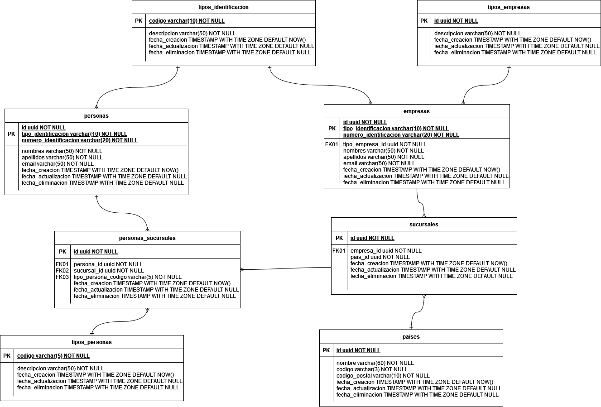
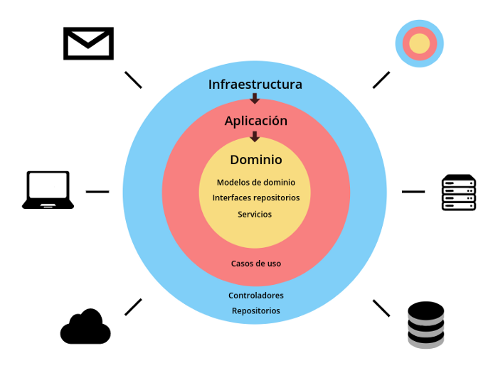

# Módulo de Gestión de datos de Personas y empresas 
* Repositorio del micro-servicio solicitado como prueba técnica de Finkargo para desarrollador back-end. 

Este proyecto es un micro-servicio el cual permite gestionar los datos de todas las empresas (proveedores, beneficiarios, partners, fiduciarias) donde nos encontramos operando en los distintos países latinoamericanos, también permite gestionar los tipos de personas que están vinculadas a cada empresa (accionistas, contactos, consultores).

Para dicha solución se tienen las siguientes consideraciones:
### * Entidades del dominio

Esta es el diagrama relacional el cual muestra como está constituido el servicio en cuanto a la base de datos, para este micro-servicio se elige como base de datos relacionales PostgreSQL, puesto que permite el manejo optimizado para índices de tipo UUID, el rendimiento es alto al momento de ejecutar consultas en ámbitos donde se tienen muchas cantidades de datos.

### * Arquitectura del servicio

Este micro-servicio se desarrolló bajo las directrices de la arquitectura hexagonal, la cual cumple con el patrón arquitectonico para arquitecturas limpias, permitiendo mantener separadas por capas la lógica respectiva, y dar cumplimiento algunos de los conceptos de diseño mencionados en Domain Driven Design (DDD), donde se pretende tener sin tecnología el corazón del sistema que en otras palabras sería la capa de Dominio (lógica del negocio); y solo a través de la capa de Aplicación se acceda a la lógica del dominio para realizar las acciones necesarias para llevar a cabo los casos de uso y así entregarle a la capa de Infraestructura los métodos requeridos para llevar a cabo las funcionalidades esperadas en el sistema.

### * Diagrama de despliegue y tecnológico

---
## Mejoras a realizar
Como siempre sabemos que las aplicaciones tienden a mejorar cada día, y como se pretende que este micro-servicio pueda seguir mejorando cada día, se propone:
* Manejo de las peticiones recibidas a través de GraphQL.

---
#### Referencias
* [Implementando DDD y Arquitectura Hexagonal en PHP con Laravel](https://fabio-schettino.medium.com/implementando-ddd-y-arquitectura-hexagonal-en-php-con-laravel-bc2d737b8460)

---
#### Anexo de tiempo gastado en el desarrollo del proyecto
* [Registro de tiempos](https://docs.google.com/spreadsheets/d/1j5ERlkMYtfqDWUrci7H8qtxVEm1GzCumvFCnAJa1fbc)
